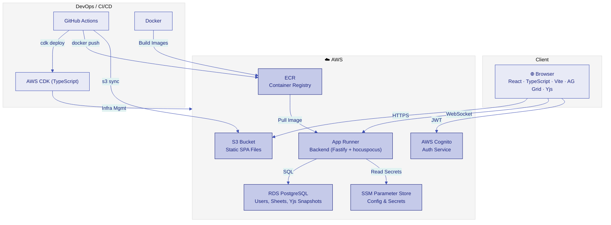
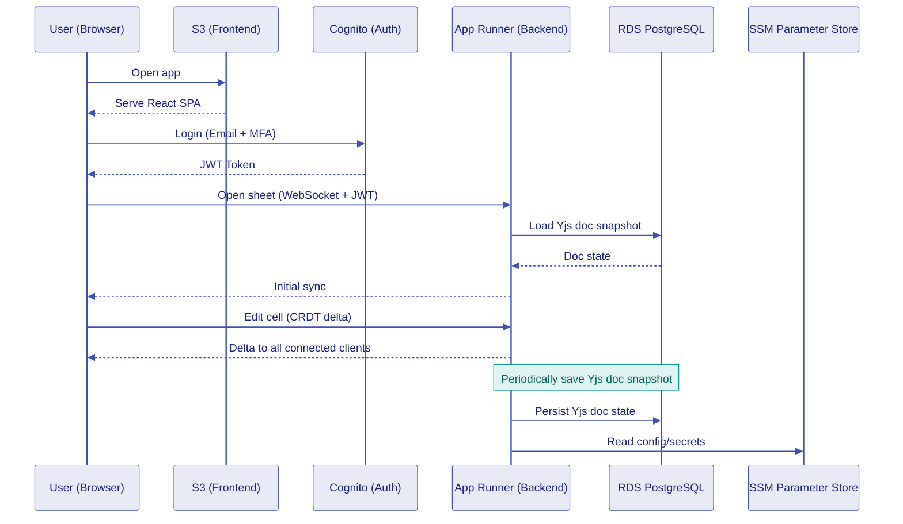
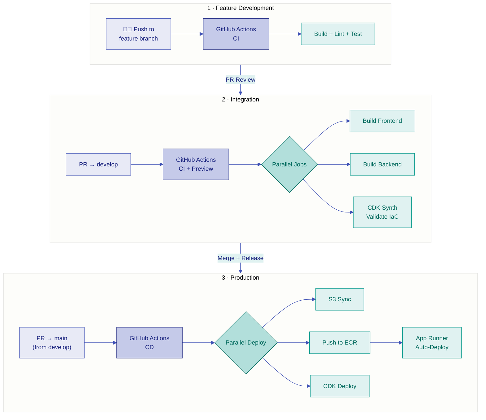

# Architecture

## Overview

CollabSheet is a real-time collaborative spreadsheet tool built on AWS. Users access the React frontend (hosted on S3), authenticate via AWS Cognito, and collaborate in real-time via WebSocket connections to the backend (App Runner).

## Diagram

## Data Flow

## Deployment Pipeline

