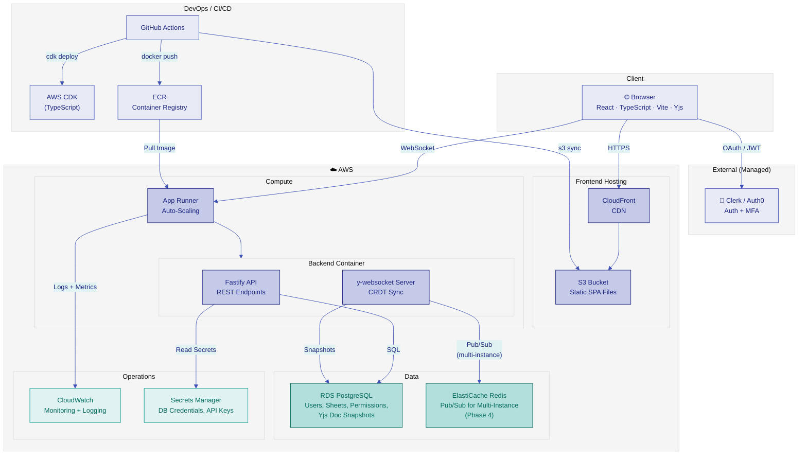
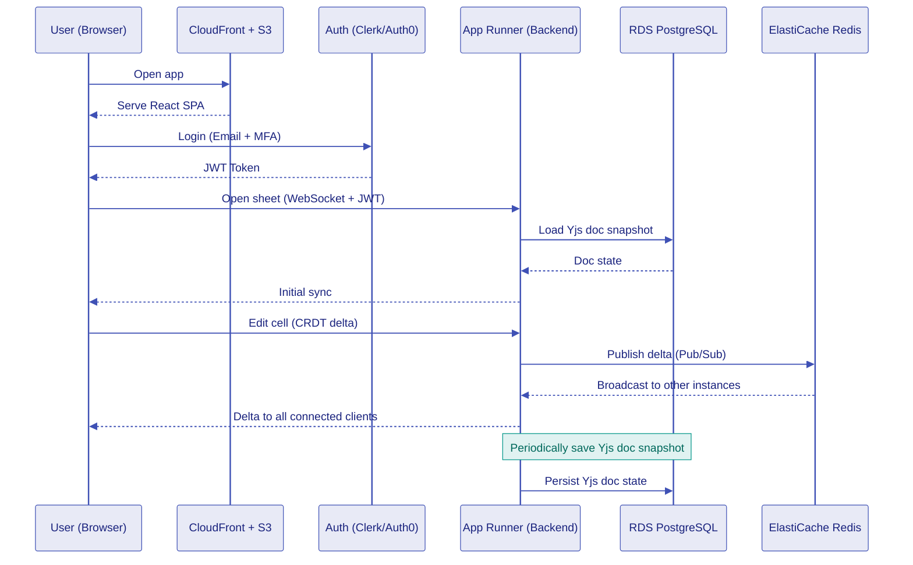
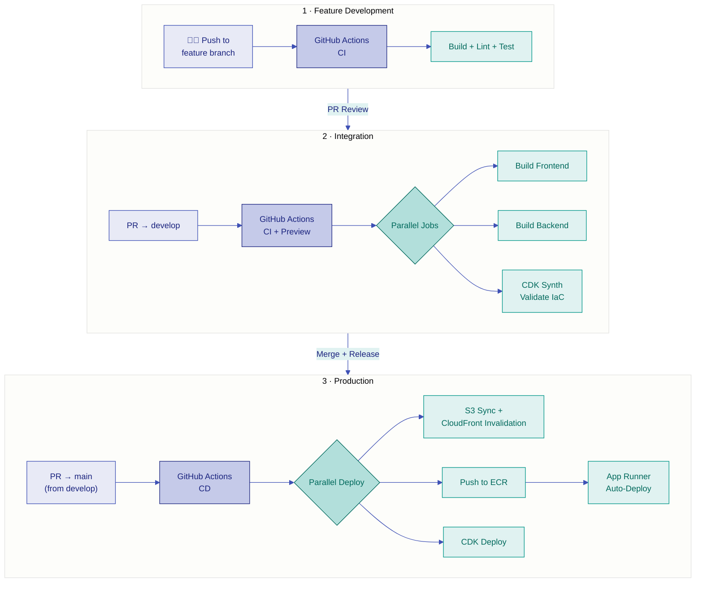

# Architecture

## Overview

CollabSheet is a real-time collaborative spreadsheet tool built on AWS. Users connect via CloudFront to the React frontend, authenticate through Clerk/Auth0, and collaborate in real-time via WebSocket connections to the backend.

## Diagram

## Data Flow

## Deployment Pipeline

